# GitHub Repo Transporter 🚚

Tired of the 1,001-click process to move a repo? This is a no-nonsense, idempotent Python script to migrate a
GitHub repository—including its code, history, issues, PRs (as issues), labels, and milestones—from
one organization to another.

It's built to be run, re-run, and trusted.

## ✨ Key Features

- **Mirror Perfect Git Data:** Uses `git clone --mirror` and `git push --mirror` for a flawless copy of all
  branches and tags.
- **Full Metadata Migration:** Replicates labels, milestones, issues, and comments.
- **Idempotent by Design:** Run it again and it won't create duplicates. It reconciles differences and
  picks up where it left off.
- **Robust & Resilient:** Includes automatic retries with exponential backoff to handle API rate limiting
  without crashing.
- **Preserves History:** Original authors and creation dates are embedded in the migrated issue and comment
  bodies for a clear audit trail.

---

## ⚙️ Setup (The 5-Minute Plan)

1. **Dependencies:** Make sure you have Python 3.6+ and install the required library.

   ```bash
   pip install PyGithub
   ```

2. **Personal Access Tokens (PATs):** You need two. Don't skimp on the scopes or it'll fail.

   - [Create PATs here](https://github.com/settings/tokens)
     - Or via `gh auth token`
   - **`SOURCE_TOKEN`**: Needs `repo` scope to read the source repository.
   - **`TARGET_TOKEN`**: Needs `repo`, `admin:org`, and **`workflow`** scopes to create the new repo and
     push GitHub Actions workflows.

3. **Configuration File:** Create a file named `config.ini` in `~/.config/github-migrator/`.

   > 🚨 **NEVER COMMIT `config.ini` TO GIT!** Add it to your `.gitignore` file immediately.

   ```ini
   # config.ini

   [GITHUB]
   # Token with read access to the source org/repo
   SOURCE_TOKEN = ghp_YourSourceTokenGoesHere...

   # Token with repo, admin:org, and workflow scopes for the target org
   TARGET_TOKEN = ghp_YourTargetTokenGoesHere...

   [SOURCE]
   ORG = source-organization-name
   REPO = the-repo-to-migrate

   [TARGET]
   ORG = target-organization-name
   REPO = new-repo-name # Can be the same or different
   ```

---

## 🚀 Usage

Once the `config.ini` is set up, just run the script. Grab a coffee; the terminal output will tell you everything.

```bash
python github-migrator.py
```

---

## 💡 How It Works

This script uses a two-pronged attack:

1. **Git CLI (`--mirror`)**: For the heavy lifting of Git data. It's the most reliable way to ensure every
   commit, branch, and tag is identical.
2. **GitHub API (`PyGithub`)**: For all metadata. It creates a "paper trail" in each new issue
   (`Migrated from org/repo#123`) to track what's been migrated, which is the key to its idempotency.

```mermaid
flowchart TD
    A[Start 🚀] --> B{Read config.ini};
    B --> C{Authenticate w/ PATs};
    C --> D[Git Push --mirror];
    subgraph API Sync
        D --> E[Reconcile Labels 🏷️];
        E --> F[Reconcile Milestones 🎯];
        F --> G[Reconcile Issues & Comments 📝];
    end
    G --> H[Done 🎉];
```



---

## 🚨 The Fine Print (Caveats)

- **Authorship:** The user owning the `TARGET_TOKEN` will be the creator of all issues and comments.
  The original author is noted in the body text (`**Original author: @user**`).
  This is a GitHub API limitation.
- **Pull Requests:** PRs are migrated as **issues**. The code branches are mirrored perfectly, but
  the "Pull Request" UI functionality (e.g., the merge button) is not recreated.
  It serves as a historical record of the discussion.
- **Not Covered:** This script handles the essentials. It does **not** migrate GitHub Packages, Projects (v2),
  Releases, or Wiki content.
